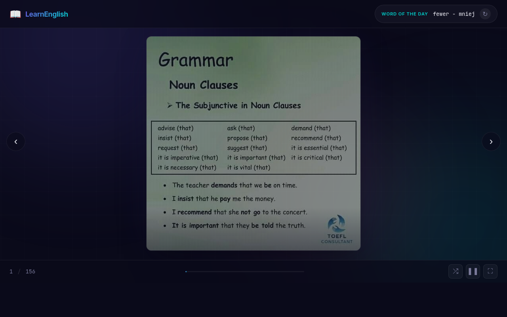

# English Learning Slideshow

Interactive English vocabulary slideshow — dark-themed SPA with Word of the Day, auto-advance timer, shuffle, and fullscreen; PHP image server, 575-word Polish–English dictionary.

## Screenshot



## Features

- **Slideshow** — 156 English learning images with 60-second auto-advance and animated progress bar
- **Word of the Day** — random word drawn from a 575-entry Polish–English dictionary
- **Navigation** — prev/next buttons, keyboard arrows, touch swipe
- **Controls** — pause/play, shuffle, fullscreen
- **Fade transitions** — smooth image crossfade with preloading

## Stack

| Layer    | Technology                        |
|----------|-----------------------------------|
| Frontend | HTML5, CSS3 (custom dark theme), Vanilla JS |
| Backend  | PHP (image directory listing → JSON) |
| Fonts    | Inter, JetBrains Mono (Google Fonts) |

## Setup

1. Copy the project to a PHP-capable web server (e.g. Apache, nginx + php-fpm).
2. Place learning images in the `english/` subdirectory.
3. Open `index.html` (served via HTTP — `get_images.php` requires a server).

```
/
├── index.html        # Main app
├── style.css         # Dark theme styles
├── script.js         # Slideshow logic, timer, word of the day
├── get_images.php    # Lists images in english/ as JSON
├── dictionary.txt    # 575 English–Polish word pairs
└── english/          # Learning image files
```

## Keyboard Shortcuts

| Key         | Action        |
|-------------|---------------|
| `←` / `→`  | Prev / Next   |
| `Space`     | Pause / Play  |
| `F`         | Fullscreen    |
